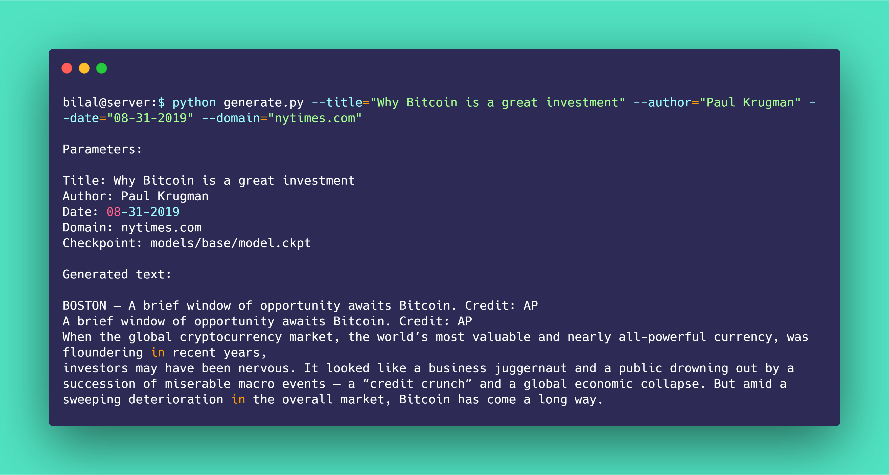

<h1 align='center'>
    Grover • 🤖📰
</h1>

<h4 align='center'>
    An easy way to use Grover (https://github.com/rowanz/grover)
</h4>

<p align='center'>
    <a href="https://forthebadge.com">
        
    </a>
    <a href="https://colab.research.google.com/github/bkkaggle/grover/blob/master/grover.ipynb">
        
    </a>
    <a href="https://github.com/prettier/prettier">
        
    </a>
    <a href="https://opensource.org/licenses/Apache-2.0">
        
    </a>
    <a href="http://makeapullrequest.com">
        
    </a>
    <a href="https://github.com/bkkaggle/grover/pulls">
        
    </a>

</p>

<p align='center'>
    <a href='#installation'>Installation</a> •
    <a href='#documentation'>Documentation</a> •
    <a href='#contributing'>Contributing</a> •
    <a href='#authors'>Authors</a> •
    <a href='#license'>License</a>
</p>

<div>
    
</div>

<p align='center'><strong>Made by <a href='https://github.com/bkkaggle'>Bilal Khan</a> • https://bkkaggle.github.io</strong></p>

<!-- START doctoc generated TOC please keep comment here to allow auto update -->
<!-- DON'T EDIT THIS SECTION, INSTEAD RE-RUN doctoc TO UPDATE -->

-   [Installation](#installation)
    -   [Colab](#colab)
    -   [Kaggle](#kaggle)
    -   [GCP](#gcp)
        -   [Vscode remote setup](#vscode-remote-setup)
-   [Documentation](#documentation)
    -   [Generation](#generation)
        -   [`python generate.py`](#python-generatepy)
-   [Contributing](#contributing)
-   [Authors](#authors)
-   [License](#license)
-   [Acknowledgements](#acknowledgements)

<!-- END doctoc generated TOC please keep comment here to allow auto update -->

# Installation

## Colab

<a href="https://colab.research.google.com/github/bkkaggle/grover/blob/master/grover.ipynb">
    
</a>

## Kaggle

Just fork my kernel: https://www.kaggle.com/bkkaggle/grover-article-generation

## GCP

-   `gcloud compute instances create grover --zone="us-west1-b" --image-family="pytorch-latest-cu100" --image-project=deeplearning-platform-release --maintenance-policy=TERMINATE --accelerator="type=nvidia-tesla-v100,count=1" --metadata="install-nvidia-driver=True" --preemptible --boot-disk-size="100GB" --custom-cpu=8 --custom-memory=16`
-   `gcloud compute ssh grover`
-   `sudo apt-get update`
-   `sudo apt-get upgrade`
-   `git clone https://github.com/bkkaggle/grover.git`
-   `cd grover`
-   `conda create -y -n grover python=3.6 && source activate grover && pip install -r requirements-gpu.txt`
-   `python download_model.py mega`

### Vscode remote setup

-   install https://marketplace.visualstudio.com/items?itemName=rafaelmaiolla.remote-vscode on vscode
-   `cmd-shift-p` and type Remote: Start Server
-   `gcloud compute ssh grover --ssh-flag="-R 52698:localhost:52698"`
-   `sudo apt -y install ruby && sudo gem install rmate`
-   to edit a file run `rmate path/to/file`

# Documentation

## Generation

### [`python generate.py`](./generate.py#L8)

Generate an article using Grover (https://github.com/rowanz/grover)

```
python generate.py --title="Why Bitcoin is a great investment" --author="Paul Krugman" --date="08-31-2019" --domain="nytimes.com"
```

_Arguments_:  
`--title` (string): The title of the generated article  
`--author` (string): The author of the generated article  
`--date` (string): The date of the generated article  
`--domain` (string): The domain name of the article's URL  
`--config` (string): The path to a model configuration file (defaults to: `lm/configs/mega.json`)
`--checkpoint` (string): The path to a saved model checkpoint (defaults to: `models/mega/model.ckpt`)

# Contributing

This repository is still a work in progress, so if you find a bug, think there is something missing, or have any suggestions for new features, feel free to open an issue or a pull request. Feel free to use the library or code from it in your own projects, and if you feel that some code used in this project hasn't been properly accredited, please open an issue.

# Authors

-   _Rowan Zellers_ - _Owner of the original repository_
-   _Bilal Khan_ - _Forked the repository and added some features_

# License

This project is licensed under the Apache 2.0 license as in (https://github.com/rowanz/grover) - see the [license](LICENSE) file for details

# Acknowledgements

This project contains code from (https://github.com/rowanz/grover)

This README is based on (https://github.com/bkkaggle/pytorch_zoo) and (https://github.com/rish-16/gpt2client)
